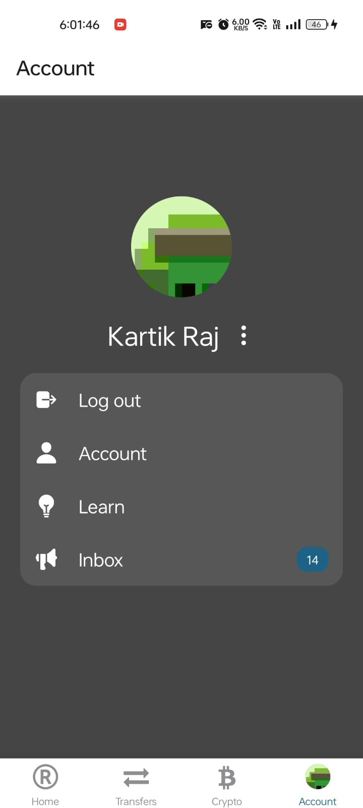

# React Native FinTech App with Clerk

This is a React Native FinTech clone using [Clerk](https://go.clerk.com/tQXLCe8) for user authentication with OTP. This app was inspired by the [Revolut](https://www.revolut.com/) app.

Additional features:

- [Expo Router](https://docs.expo.dev/routing/introduction/) file-based navigation and API Routes
- [SMS OTP](https://clerk.com/docs/custom-flows/email-sms-otp?utm_source=sponsorship&utm_medium=github&utm_campaign=simong&utm_content=rn-fintech) Auth with Clerk
- [Reanimated](https://docs.swmansion.com/react-native-reanimated/) 3 for animations
- [Gesture Handler](https://docs.swmansion.com/react-native-gesture-handler/) for gestures
- [Zustand](https://zustand-demo.pmnd.rs/) and [MMKV](https://github.com/mrousavy/react-native-mmkv) for state management
- [React Native Gifted Charts](https://github.com/FaridSafi/react-native-gifted-chat) for charts
- [Zeego](https://zeego.dev/start) for native menus
- [CoinMarketCap API](https://coinmarketcap.com/api/documentation/v1/) for crypto prices

## Screenshots

## Demo

